SweetBloom -> Aplikasi web toko kue handmade berbasis Laravel dengan sistem autentikasi lengkap.

Fitur: 

Autentikasi
- Register -> Pendaftaran akun baru dengan validasi nama, email, dan password (min. 8 karakter, harus mengandung huruf dan angka)
- Login -> Login dengan email dan password, dilengkapi proteksi brute-force (akun dikunci setelah 5 kali gagal selama 15 menit)
- Logout -> Sesi dihapus dengan aman dari server
- Forgot Password -> Kirim link reset password ke email
- Reset Password -> Reset password melalui link yang dikirim via email (berlaku 1 jam)

Profil Pengguna
- Lihat dan edit informasi akun (nama, nomor telepon, alamat)
- Ubah password dengan verifikasi password lama
- Hapus akun secara permanen

Dashboard
- Tampilan produk best seller
- Keranjang belanja (tambah, kurangi, hapus item)
- Filter dan pencarian produk
- Wishlist produk

Keamanan
- Session-based authentication menggunakan Laravel
- Proteksi brute-force login
- Password strength indicator saat registrasi
- Login log (mencatat IP, user agent, status login)

Screenshots

Login
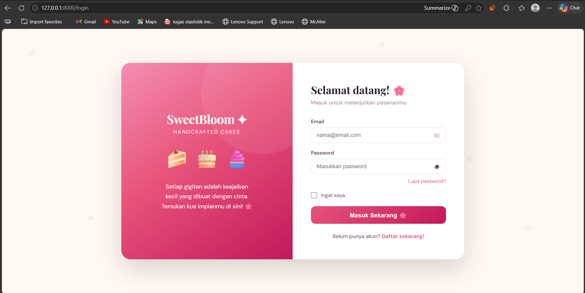

Register
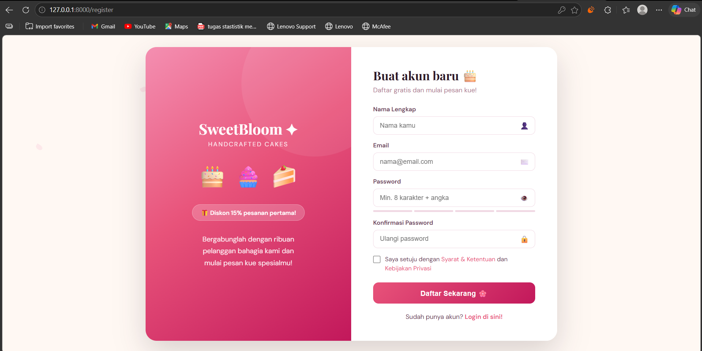

Dashboard
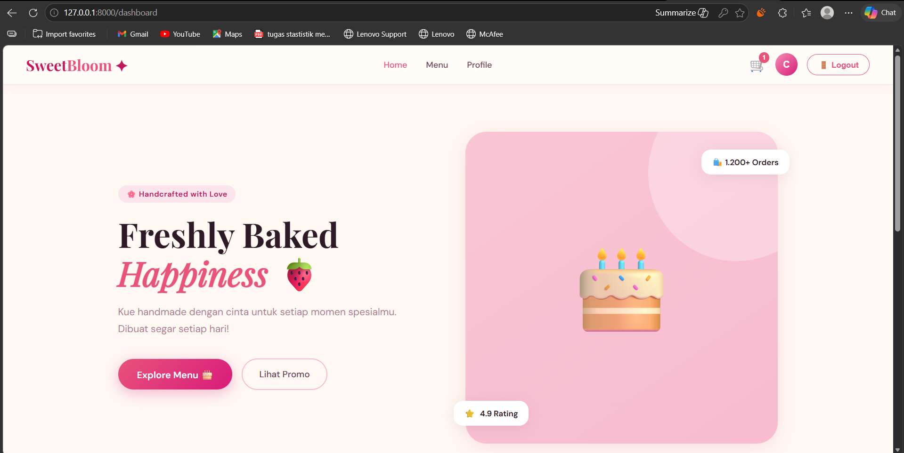
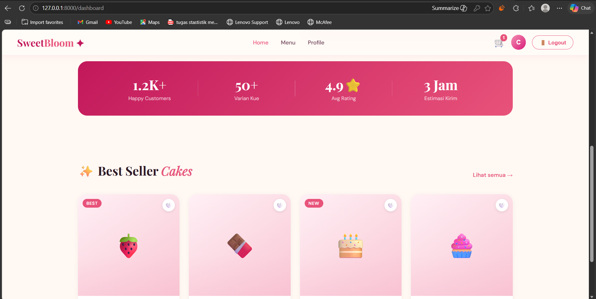
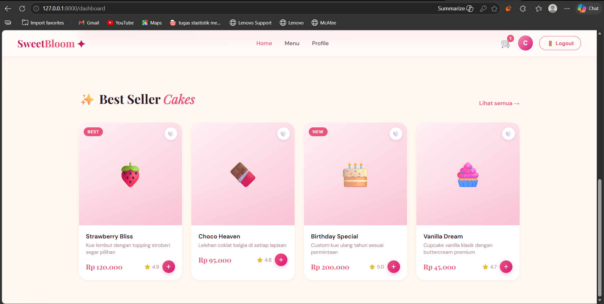

Product
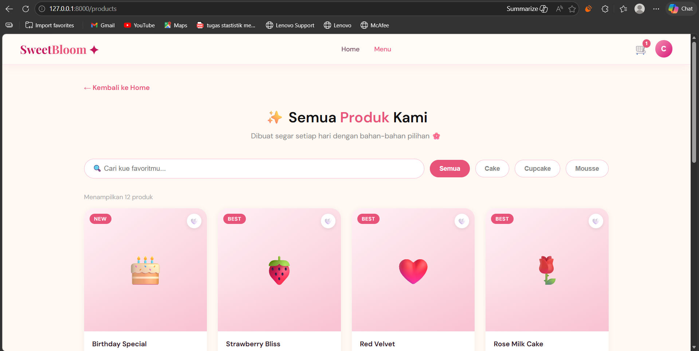
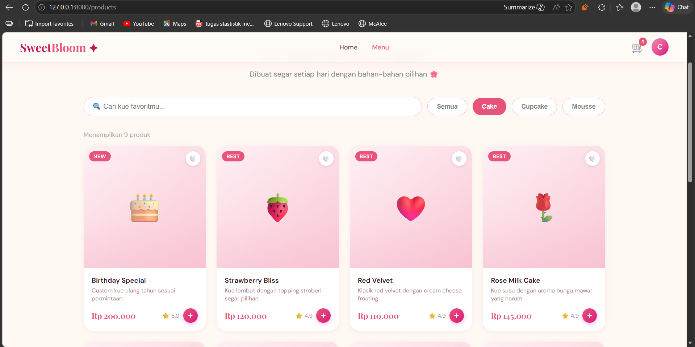
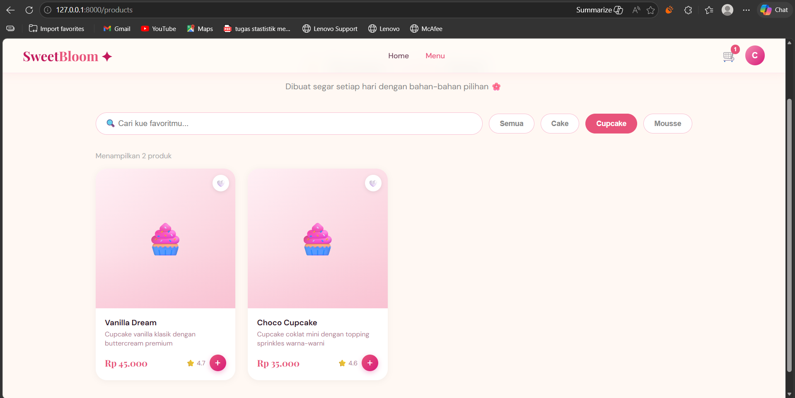
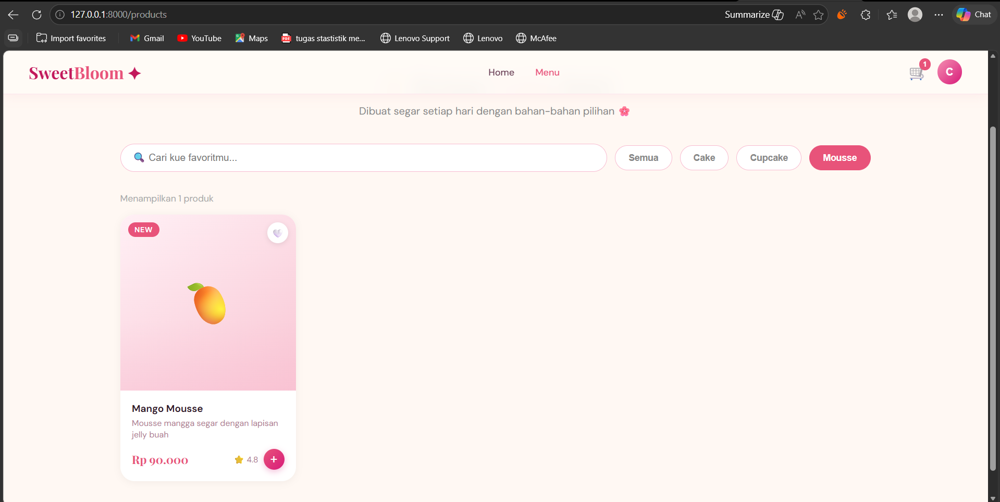

Keranjang Belanja
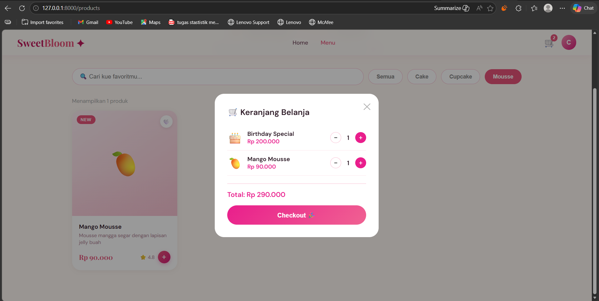

Profile
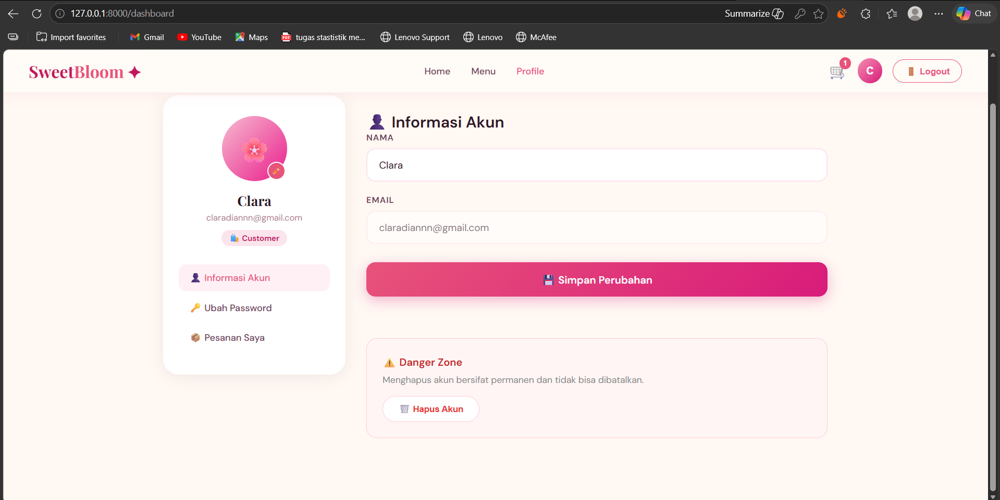
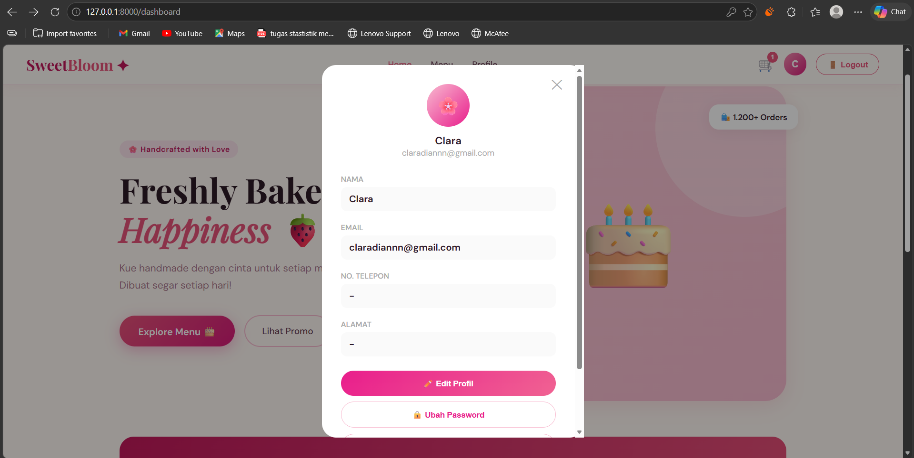

Forgot Password
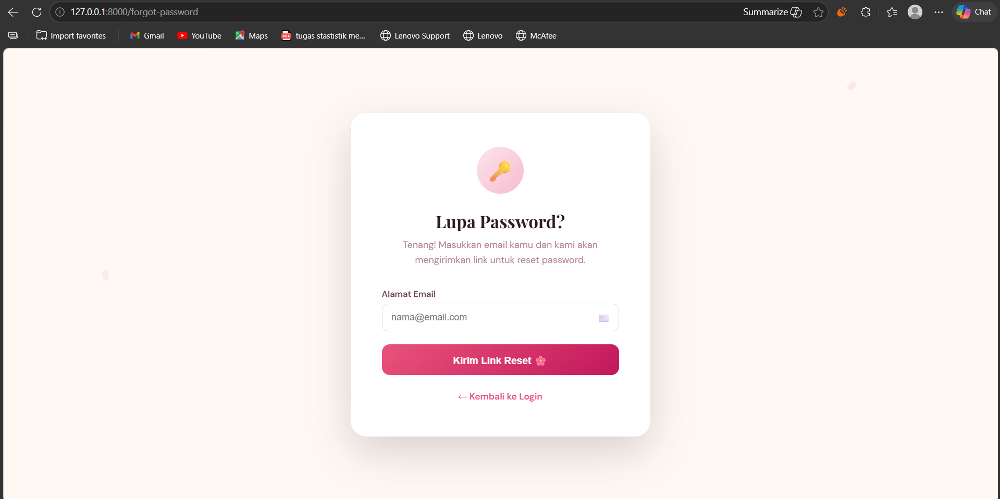
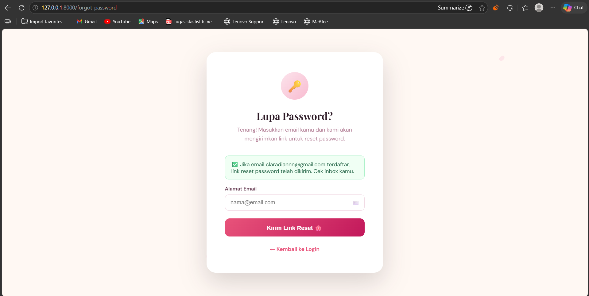

